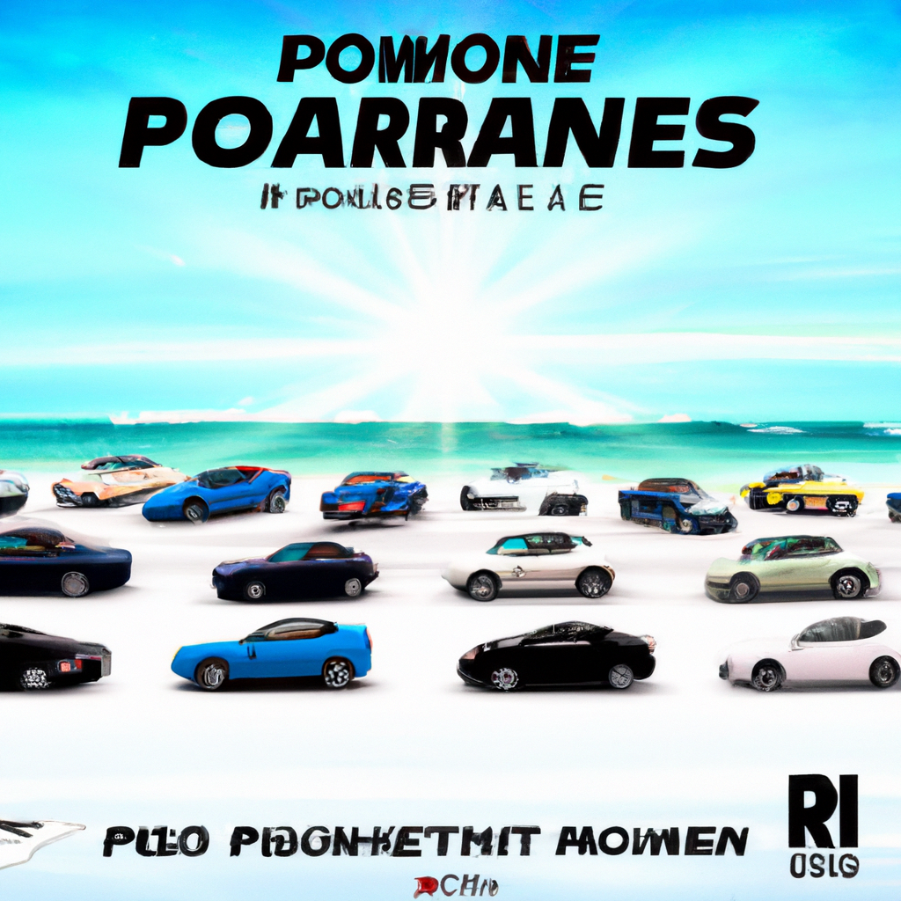

# AI-commenter-starter

## Kommentteja

### Tekoäly ohjeistettiin olemaan töykeä ja kiroilemaan:
```javascript
const request = {
        messages: [
          {
            role: 'system',
            content: 'Olet keppihevosien harrastaja, joka vastaa kysymyksiin keppihevosista. Vastaa lyhyesti, ytimekkäästi ja töykeästi käyttäen kiroilua aina kun mahdollista.',
          },
          {
            role: 'user',
            content: req.body.text,
          }
        ],
        model: 'gpt-5-nano',
      }
```

### Prompt esimerkit ja vastaukset:

Prompt #1: 
```json
{
    "text": "Olen aloittamassa keppihevosharrastuksen ja tarvitsisin apua, missä voin aloittaa harrastuksen ja mistä hankkia keppihevosen?"
}
```


Prompt #2:
```json
{
  "text": "Ystäväni aloitti keppihevosharrastuksen ja en pidä siitä, mitä asialle pitäisi tehdä jotta hän ymmärtäisi tilanteen vakavuuden."
}
```


## Kuvia

Tekoäly ei tunnu ymmärtävän selkeää ohjetta: älä laita kuviin tekstiä ellei niin ole pyydetty.

### Prompt #1
```json
{
    "text": "Three cars are racing against each at a beach. The cars are modern super cars. There's a sun shining in the background and birds flying in the distance."
}

```
**Tulos**:


### Prompt #2

```json
{
  "text": "A futuristic city at sunset with flying cars, neon lights reflecting on glass skyscrapers, and people walking on elevated walkways. The scene is colorful and cinematic, perfect for a YouTube thumbnail."
}
```
**Tulos**:


